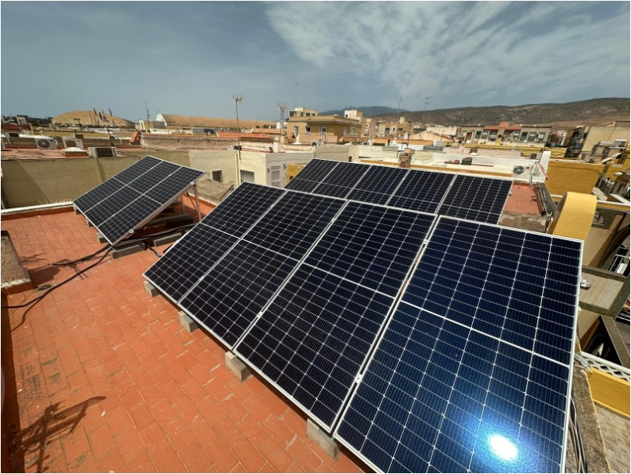
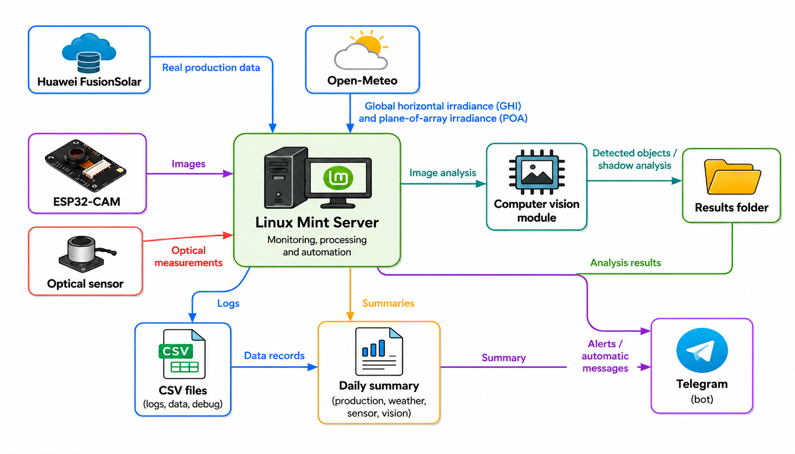
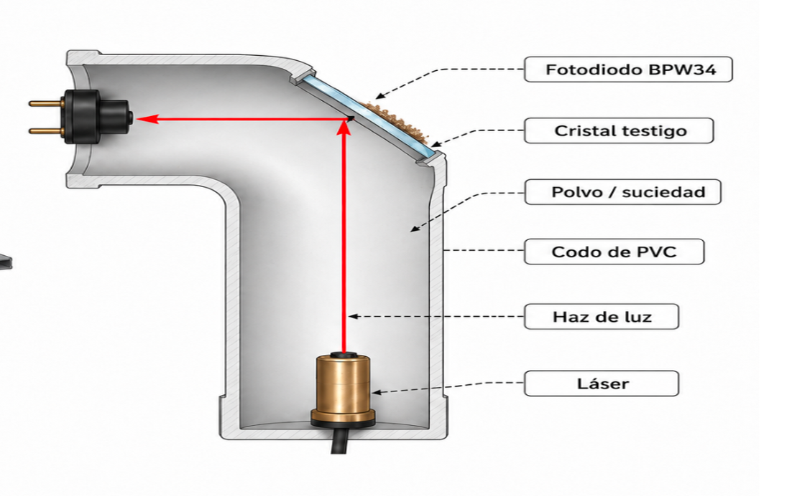
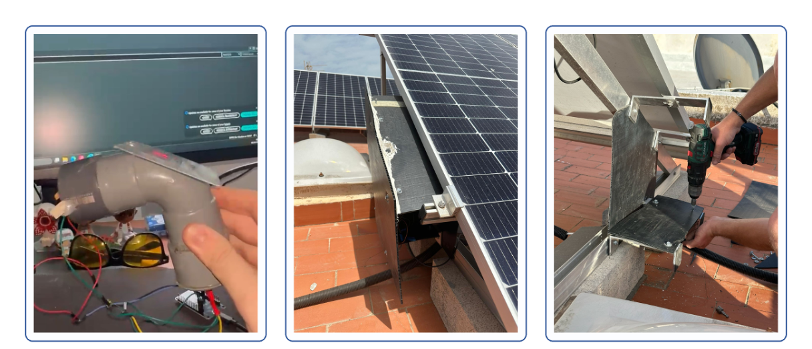
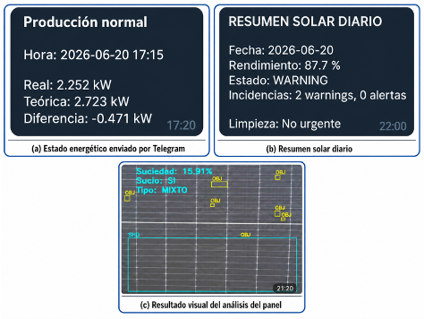

# Photovoltaic Monitoring System

This repository contains the photovoltaic monitoring system I developed for my Bachelor's Thesis in Computer Engineering at the University of Almería.

The project started with a simple question: **how can I tell whether a photovoltaic installation is producing what it should, and identify what may be causing a loss in performance?**

To explore that problem, I built and deployed a monitoring system on a real residential photovoltaic installation consisting of 12 solar panels with a total installed capacity of 5 kWp.

Rather than relying on a single measurement, the system uses several sources of information: real production data from the inverter, theoretical production based on weather and irradiance data, computer vision, and an experimental optical sensor designed to measure soiling.

The complete system runs automatically on a dedicated Linux server and was designed to operate continuously with minimal manual intervention.

This project received a final grade of **10/10 with Honors (Matrícula de Honor)**.

<p align="center">
  
</p>

<p align="center">
  <em>The 5 kWp residential photovoltaic installation used to develop and test the system.</em>
</p>

---

## How the system works

The monitoring system brings together photovoltaic production data, meteorological information, computer vision and an experimental optical sensor.

All of these components are coordinated by a Linux server responsible for executing the monitoring processes, storing results and generating notifications.

<p align="center">
  
</p>

The architecture shown above corresponds to the system developed during the Bachelor's Thesis.

### Production monitoring

One of the main parts of the project is the comparison between expected and actual photovoltaic production.

Real production data is obtained from **Huawei FusionSolar**, while meteorological and solar irradiance data from **Open-Meteo** is used to estimate how much power the installation should be producing under the current conditions.

The system periodically compares both values and records deviations between expected and actual performance.

This provides a first indication that something may be affecting the installation, but production data alone does not necessarily explain the cause of that deviation. For this reason, I explored additional ways of observing what was happening on the panels themselves.

### Computer vision

An **ESP32-CAM** is used to capture images of a photovoltaic module.

The images are processed in Python to isolate the panel surface and analyze different elements that could affect its performance.

The image-processing pipeline was developed to detect visible objects or contamination and identify areas affected by shadows. The resulting analysis provides an additional source of information alongside the production comparison.

### Experimental optical soiling sensor

One of the parts of the project that required the most experimentation was the development of a custom optical sensor for estimating accumulated dirt.

The prototype is based on an **ESP32, a BPW34 photodiode, a laser and an exposed reference glass**.

The idea is to measure how the transmission of light through the reference surface changes as dirt accumulates on it.

<p align="center">
  
</p>

The sensor went through several physical prototypes before reaching the version installed next to the photovoltaic panels.

<p align="center">
  
</p>

Building this part of the system involved not only programming the ESP32, but also designing and testing the physical structure, positioning the optical components and adapting the prototype for outdoor operation.

---

## Automation and continuous operation

I wanted the project to work as an actual monitoring system rather than as a collection of scripts that had to be launched manually.

The software therefore runs on a dedicated Linux server using **systemd services and timers**.

Different processes are responsible for periodically retrieving production and meteorological data, performing the comparison, reading the optical sensor, processing images and generating daily monitoring summaries.

A Telegram bot is also integrated into the system to provide information and notifications without requiring direct access to the server.

An example of the output generated by the system is shown below.

<p align="center">
  
</p>

This setup allowed the prototype to operate continuously on the real installation and collect information without requiring the monitoring scripts to be started manually.

---

## Technologies used

The project brought together several areas of computer engineering that I wanted to explore within a single real-world system.

**Software and infrastructure**

- Python
- OpenCV
- Selenium
- Requests
- Linux
- systemd
- Telegram Bot API

**Hardware and embedded systems**

- ESP32
- ESP32-CAM
- BPW34 photodiode
- Custom optical sensing prototype

**External services and data**

- Huawei FusionSolar
- Open-Meteo
- Roboflow

---

## Repository structure

```text
.
├── hardware/
│   ├── esp32-cam/
│   └── sensor-optico/
│
├── software/
│   └── vision/
│       └── src/
│
├── deployment/
│   └── systemd/
│
├── docs/
│   └── images/
│
├── requirements.txt
└── README.md
```

The `hardware/` directory contains the firmware and embedded components used by the ESP32 devices.

The main Python software is located under `software/vision/src/`. These modules handle production monitoring, meteorological data, image processing, optical sensor logging, daily summaries and Telegram communication.

The `deployment/systemd/` directory contains the service and timer templates used to automate the different processes on Linux.

---

## Running the software

The Python dependencies used by the project are listed in `requirements.txt`.

They can be installed inside a virtual environment with:

```bash
pip install -r requirements.txt
```

The project requires configuration for the external services used by the monitoring system.

Credentials are provided through environment variables rather than being stored directly in the source code. This includes the FusionSolar credentials and Telegram configuration.

Runtime-generated data such as logs, captured images, debugging outputs, session cookies, cache files and daily summaries are excluded from the public repository.

---

## About this project

This system was developed as my **Bachelor's Thesis in Computer Engineering at the University of Almería**, where it received a final grade of **10/10 with Honors (Matrícula de Honor)**.

What interested me most about the project was that it did not end when the thesis was submitted.

Building and running the system on a real installation exposed limitations that were difficult to see during the initial design and raised new questions about reliability, scalability and how photovoltaic installations can be monitored over longer periods of time.

For that reason, I decided to continue working on the project after finishing my degree.

This repository is kept as the public record of the system developed during the Bachelor's Thesis. The work that followed it is being developed separately, with the long-term goal of building a more robust and scalable approach to photovoltaic monitoring.
